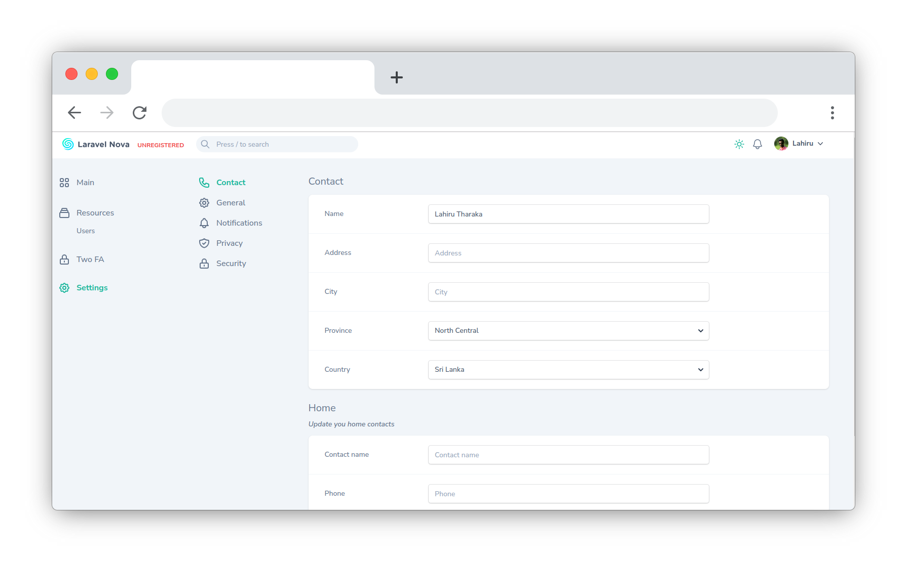

<!-- <p align="center">


</p> -->


# ⚙ Nova Settings

Settings management UI for Laravel Nova™ dashboard using **Native fields**




<br>

### 💠 Install

```bash
composer require visanduma/nova-settings
```
<br>

### 💠 Configuration

Publish config & migrations

```
php artisan vendor:publish --tag=nova-settings
```

Run migration

```
php artisan migrate
```

Update config file (optional)

```php

<?php

return [
     /* default path for load settings class */
    'settings_path' => app_path('Nova/Settings'),
];

```

Use trait in Model. generally in `User.php`

```php
use Visanduma\NovaSettings\HasNovaSettings;

class User extends Authenticatable
{
    use HasNovaSettings;

}

```
<br>

### 💠 Create your first setting class

You can use `nova-settings:create` command to build a fresh settings class

```

php artisan nova-settings:create Contact

```

Adding fields is the same as in Nova Resource

```php
class Contact extends NovaSettingsMum

{

    public $icon = 'phone';


    public function fields()

    {

        return [

            Text::make('Name')->rules('required'),

            Text::make('Address')->rules('required'),

            Text::make('City')->rules('required'),

            Select::make('Province')->options([
                'NC' => 'North Central',
                'N' => 'Northern',
            ]),

            Country::make('Country')->rules('required'),

            Panel::make('Home', [

                Text::make('Contact name'),

                Text::make('Phone'),

            ])->help('Update you home contacts'),

        ];

    }
}

```
<br>

### 💠 Registering settings

All settings class in the default path are automatically registered. If you are going to use a different path, please configure it in `nova-settings.php`

If you want to register settings class manually, use `NovaSettings::register` method in the service provider

```php
namespace App\Nova\Settings;

public function boot()

{
        NovaSettings::register([
            Contact::class,
        ]);
}
```
<br>

### 💠 Customizing the settings class

You can customize settings class as per your needs

Customizing settings menu icon. you can use any [Heroicons](https://v1.heroicons.com/)

```php
public $icon = 'bell';
```

Customizing section label

```php
 public function label():string

 {

    return 'User contacts';

 }
```

Customizing uriKey. `uriKey` is used when saving/retrieving the settings

```php
 public function uriKey(): string

 {
    return 'user-contacts';
 }
```
<br>

### 💠 User settings vs Global settings

There are two type of settings. **User settings** & **Global Settings**.
User settings is always bound to an entity (Generally for User Model) while global settings are not bound to any entity

You can easily configure the settings type with `global` property in the settings class

```php
    protected bool $global = false;
```
<br>

### 💠 Retrieving the settings

```php
use Visanduma\NovaSettings\NovaSettings;

// getting single value
NovaSettings::get('contact.name', 'default value');

nova_settings('contact.name','default value');

// getting whole settings array
NovaSettings::get('contact');

nova_settings('contact');


// getting global settings
NovaSettings::global('system.email');

NovaSettings::global('system');

nova_settings_global('system.phone'),
```
<br>

### 💠 Transforming inputs

If you need to customize user-submitted form data, override the following method in the settings class. This method will receive form data array as its argument

```php
protected function transformInputs(array $inputs): array

{
    // do your modifications

    return $inputs;
}
```
<br>

### 💠 Hooks

```php
protected function afterSaved(NovaRequest $request)

{
        // this method will be called after the form is saved
}
```
<br>

### Known issues

- File inputs does not work correctly
- Uploaded files cannot be delete
- Not works well with 3rd party fields

### Todo

- [ ] Authorization
- [ ] Caching
- [ ] Events

## Credits

- [Visanduma](https://github.com/Visanduma)
- [LaHiRu](https://github.com/lahirulhr)
- [All Contributors](../../contributors)

## License

The MIT License (MIT). Please see [License File](LICENSE.md) for more information.
